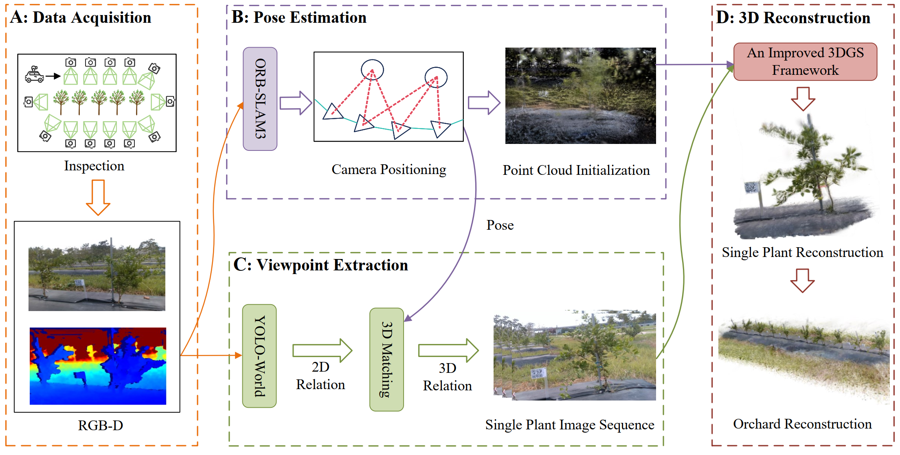

# InspectGaussian

**InspectGaussian** is a comprehensive framework designed for the reconstruction and detection of large-scale orchards (e.g., citrus orchards). The framework integrates **pose estimation**, **single-plant view extraction**, and an **improved 3D Gaussian Splatting (3DGS)** technique to achieve high-precision 3D reconstruction and analysis of orchard environments.



This repository currently open-sources the **Single Plant View Extraction** module. By utilizing RGB-D image sequences and corresponding camera poses, this module automatically extracts all observational views of each individual plant from continuous video streams through spatial projection and global ID matching algorithms.

---
## 📌 Overview

This project focuses on **plant-level understanding from continuous RGB-D sequences**. The full pipeline consists of three key components:

1. **Pose Estimation**  
   - Based on ORB-SLAM3 implementa
   - 
2. **Single-Plant View Extraction** ✅ *(Released)*  
   - Extracts all observations of each plant from video streams  
   - Based on spatial projection and global ID association  

3. **Improved 3D Gaussian Splatting (3DGS)** ✅ *(Released)*  
   - Enhances reconstruction quality for orchard environments  
   - Supports downstream structural and phenotypic analysis

## 🛠 Prerequisites

Please ensure your environment has the following dependencies installed:
* **Python**: 3.8+
* **PyTorch**: CUDA support is recommended for YOLO-World acceleration.
* **Open3D**: Used for point cloud transformation and coordinate processing.
* **Ultralytics (YOLO-World)**: Used for zero-shot object detection.
* **OpenCV**: Used for image I/O and processing.
* **tqdm**: Progress bar display.

### Installation

```bash
pip install torch torchvision ultralytics open3d opencv-python tqdm numpy
```

Note: You must download the corresponding weight file yoloworld_weights/best_forhuanong.pt and place it in the designated directory.

## 📂 Input Requirements

The code requires an input folder (specified by datapath) with the following structure:

```bash
datapath/
├── color/                # Original RGB images (.png)
├── depth/                # Original depth images (.tif)
├── associations.txt      # Association file linking image filenames to timestamps
└── CameraTrajectory.txt  # Camera trajectory file (output from ORB-SLAM, etc.)
```
Trajectory File Format: Each line should be timestamp tx ty tz qx qy qz qw.

Association File Format: Each line should be timestamp_filename filename.

## 🚀 Usage
After configuring the environment and preparing your data, run id_divid.py directly:

```bash
python id_divid.py
```
